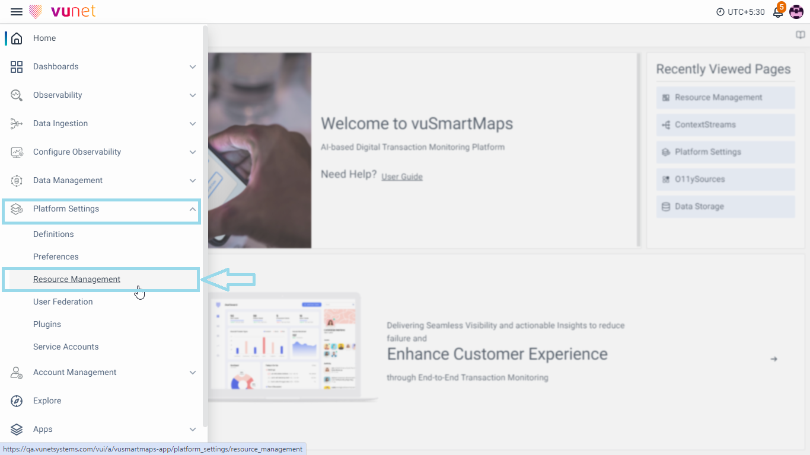
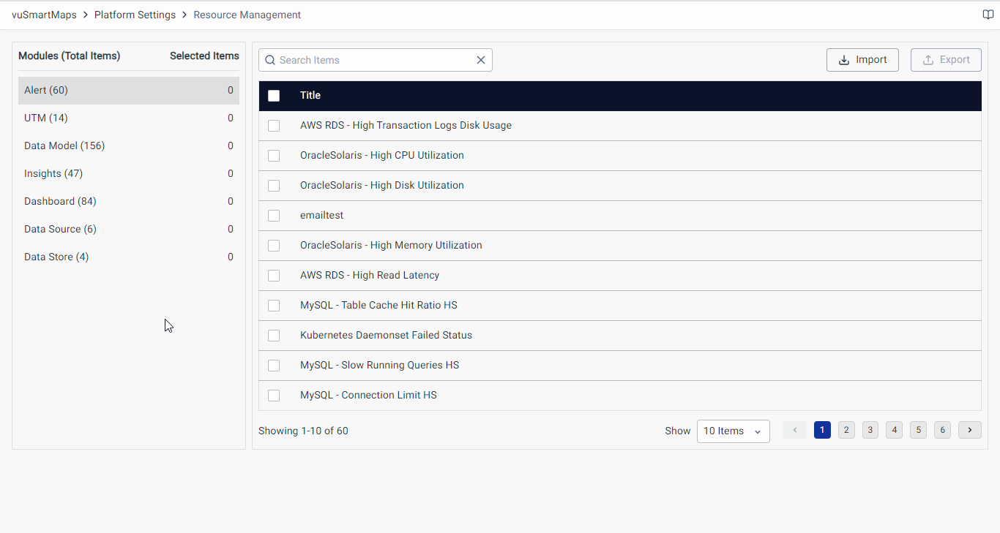
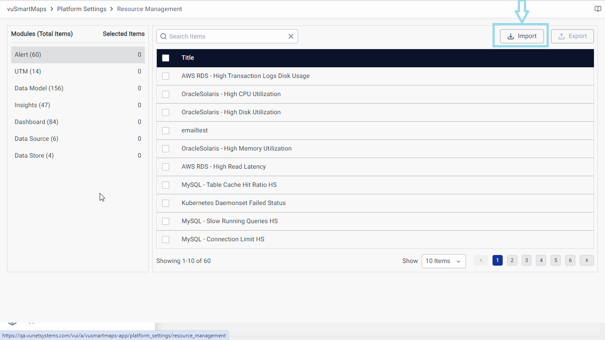
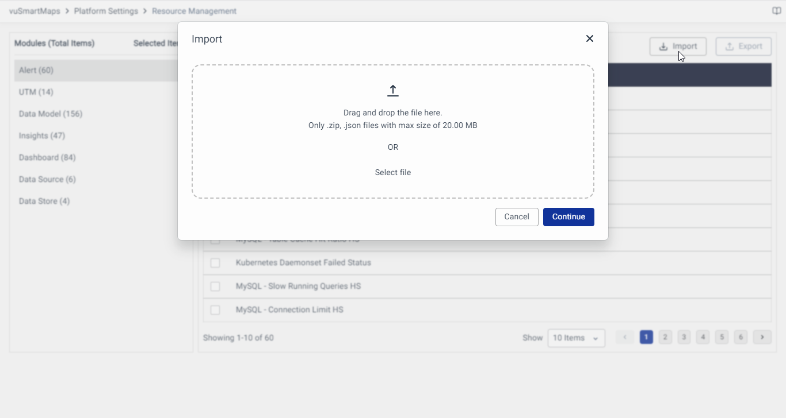
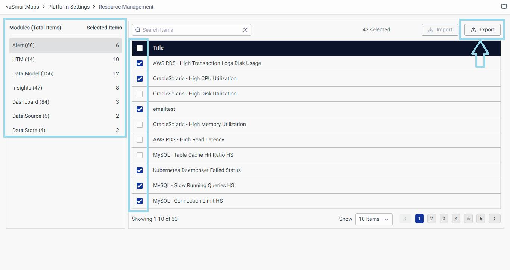
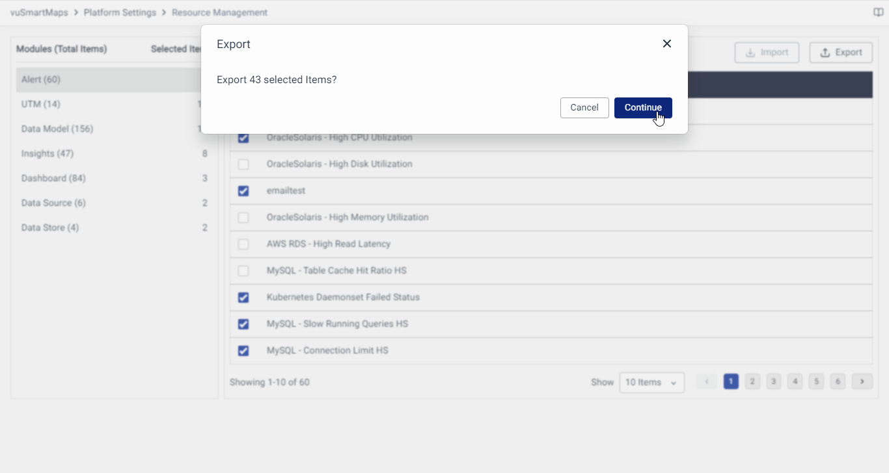
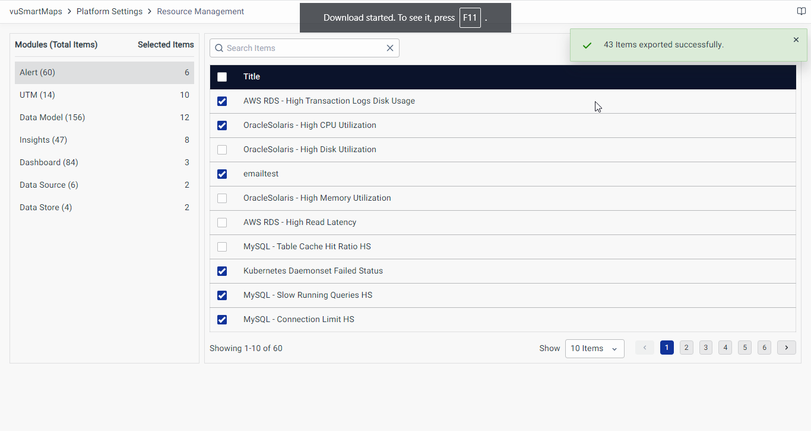

# Resource Management - gd2md
:::info
This chapter is compiled by downloading markdown from google chrome extension "Docs to Markdown Pro".
- md file will be downloaded with images as inside ZIP.
- Extract the ZIP, copy md file and images folder to the folder where it is to be placed.
- TOC can be deleted.
- In the beginning add front matter with `sidebar_position`.
- Update Heading hierarhies. H1 to H2, H2 to H3, and so on. This will be automated with this extension. Ensure Settings have enabled `Demote Heading levels`
- Make sure file names and folder names do not have any spaces in it.
- Remove un-necessary blank lines from generated md file.
- With this plugin, the content which is inline with the images is being dropped. Needs to be manually added.
- Alignments of sub points for bullets & numbered lists may be required to be manually checked.
:::

## Introduction

Resource Management in vuSmartMaps simplifies the organization, control, and efficient handling of vital platform components. This tool encompasses dashboards, alerts, data models, insights, dashboards, data sources, and data stores. It facilitates easy packaging of these components into the platform, promoting sharing, deployment, and reuse.

[Go to Page 1](./Resource-Management/#use-case)

[Go to Tutorial Advanced](../tutorial-extras/manage-docs-versions/#add-a-version-dropdown)

Resource Management serves as a centralized hub during import and export operations. It enhances the platform's overall efficiency and productivity by addressing several key needs. In essence, Resource Management in vuSmartMaps streamlines component handling, enabling easy sharing, efficient organization, and consistent performance. It simplifies the packaging and deployment of components, enhancing productivity and collaboration within the platform. With Resource Management, you can optimize your workflow and minimize the risk of errors, harnessing the full potential of vuSmartMaps.

## Use Case

Imagine a scenario where you need to export a combination of Alerts, Insights, and Dashboards from vuSmartMaps to an external system. This task is often crucial for creating comprehensive reports or engaging presentations. Traditionally, achieving this would involve a laborious process.

You'd have to individually access each section, navigate through complex export procedures, and spend significant time and effort on a series of convoluted steps.

However, Resource Management in vuSmartMaps transforms this cumbersome process into a streamlined and efficient workflow. Here's how it simplifies component export:

With just one click, you can access the Resource Management interface, providing you with a centralized hub for component management. Within this unified interface, selecting all the desired components for export becomes a breeze. No more jumping between different sections or navigating complex export steps.

Resource Management streamlines the export process, saving you valuable time and effort. It eliminates the need for tedious and convoluted procedures, enhancing your overall productivity. Now, you can focus on creating valuable reports and presentations without being bogged down by cumbersome tasks.

In this use case, Resource Management empowers you to efficiently export various components, ensuring a seamless and straightforward experience. It centralizes access, simplifies selection, and ultimately boosts productivity, enabling you to make the most of your vuSmartMaps platform.

## Working with Resource Management

1. The Definitions page can be accessed from the platform left navigation menu by navigating to **Platform Settings** > **Resource Management**.

2. The Resource Management page will look like this after you navigate to it:

3. On the landing page, there is a list of all the components that can be managed on the left side and it includes:

    - Alert
    - UTM
    - Data Model
    - Insights
    - Dashboard
    - Datasource
    - Data Store

4. The top right side contains the Import and Export button to [Import](#import-component) or [Export](#export-component) any of the components.

### Import Component

1. Begin by accessing the Resource Management feature in vuSmartMaps.

2. Once you're in the Resource Management interface, locate the **Import** button positioned at the top-right corner of the page. Click on the **Import** button to initiate the component import process.

3. You will be prompted to upload a JSON file containing the component you wish to import. Please note that you can import multiple files conveniently by selecting zip files containing multiple components.

   

   There are two straightforward methods for uploading your file:

   1. **Drag and Drop**: Simply drag the file from your local system and drop it onto the page.  
   2. **Select File**: Click the "Select File" button and choose the file you want to upload from your system.

4. After uploading your file, the system will request confirmation. To proceed, click on the **Continue** button.

5. If your uploaded file is valid and the import process is successful, you will receive a reassuring "Success" message.

By following these step-by-step instructions, you can effortlessly import components into vuSmartMaps using the Resource Management feature.

### Export Component

1. Begin by accessing the Resource Management feature in vuSmartMaps.

2. In the Resource Management interface, navigate to the component you wish to export. Click on the specific component to select it.

3. Upon selecting one or more components, the **Export** button located within the interface will be activated.

4. Once you've selected your desired component(s), click on the Export button to initiate the export process. Please note that the table on the left side shows the total number of items available and selected items across all the modules.

5. You will receive a confirmation prompt. To proceed, click on the Continue button.

6. The selected component(s) will be exported. Upon successful export, a "Success" message will be displayed.

**💡Note:** The exported component(s) will be downloaded in a .json extension for single components or combined into a .zip extension if multiple files are selected for export.

By following these step-by-step instructions, you can easily export components from vuSmartMaps using the Resource Management feature.

## Key Takeaways

Resource Management in vuSmartMaps offers users the necessary tools to maximize the value and efficiency of the vuSmartMaps platform. Resource Management in vuSmartMaps offers the following key benefits:

- Resource Management in vuSmartMaps enables an efficient organization, sharing, and control of platform components, optimizing resource utilization.

- It streamlines workflows by providing a logical structure for locating and accessing resources, saving time, and enhancing productivity.

- Collaboration is enhanced as users can easily share and work on shared resources, reducing duplication of effort.

- Component integrity and consistency are maintained, ensuring data accuracy and system reliability.

- Migration and backup capabilities support data continuity and disaster recovery, safeguarding valuable information.

## FAQs
Some random FAQs added below for sample.

  How many resources (money, person-hours, etc.) am I willing to invest in this?

- 🔴 Self-hosting requires experience in networking as well as Linux and web server administration. It's the most difficult option, and would require the most time to manage successfully. Expense-wise, cloud services are almost never free, and purchasing/deploying an onsite server can be even more costly.
- 🟢 Jamstack providers can help you set up a working website in almost no time and offer features like server-side redirects that are easily configurable. Many providers offer generous build-time quotas even for free plans that you would almost never exceed. However, free plans have limits, and you would need to pay once you hit those limits. Check the pricing page of your provider for details.
- 🟡 The GitHub Pages deployment workflow can be tedious to set up. (Evidence: see the length of [Deploying to GitHub Pages](#deploying-to-github-pages)!) However, this service (including build and deployment) is always free for public repositories, and we have detailed instructions to help you make it work.

How much server-side customization do I need?

- 🟢 With self-hosting, you have access to the entire server's configuration. You can configure the virtual host to serve different content based on the request URL, you can do complicated server-side redirects, you can implement authentication, and so on. If you need a lot of server-side features, self-host your website.
- 🟡 Jamstack usually offers some server-side configuration (e.g. URL formatting (trailing slashes), server-side redirects, etc.).
- 🔴 GitHub Pages doesn't expose server-side configuration besides enforcing HTTPS and setting CNAME records.

Do I need collaboration-friendly deployment workflows?

- 🟡 Self-hosted services can leverage continuous deployment functionality like Netlify, but more heavy-lifting is involved. Usually, you would designate a specific person to manage the deployment, and the workflow wouldn't be very git-based as opposed to the other two options.
- 🟢 Netlify and Vercel have deploy previews for every pull request, which is useful for a team to review work before merging to production. You can also manage a team with different member access to the deployment.
- 🟡 GitHub Pages cannot do deploy previews in a non-convoluted way. One repo can only be associated with one site deployment. On the other hand, you can control who has write access to the site's deployment.

