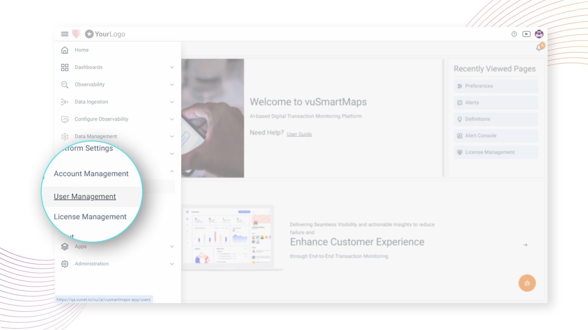
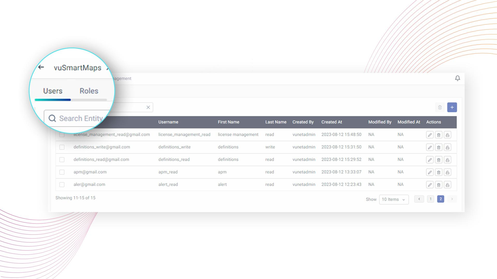

# User Management

import useBaseUrl from '@docusaurus/useBaseUrl';

<video controls width="100%" poster={useBaseUrl('/videos/RBAC-Diagram.png')}>
  <source src={useBaseUrl('/videos/O11ySourcesIntro.mp4')} type="video/mp4" />
</video>

## Introduction

User Management in vuSmartMaps is your key to managing user access securely and efficiently. This section provides you with the tools to control who can access what within the vuSmartMaps platform, ensuring a smooth and secure experience.

In vuSmartMaps, each user is assigned specific permissions based on their role. These permissions determine what they can do and see in the platform, aligning access with organizational needs.

Role-Based Access Control (RBAC) plays a pivotal role in this process. With RBAC implementation in vuSmartMaps, users are mapped to roles, and roles are assigned specific permissions. This approach allows for selective granting of access, ensuring that only authorized users can access designated functions, resources, or information. RBAC acts as a protective shield, detecting and blocking unauthorized access while seamlessly allowing authorized users to perform their tasks.

### Key Benefits of User Management

Let's explore the key benefits that User Management brings to your vuSmartMaps experience:

- **Role-Based Access Control (RBAC):** We use RBAC to let you grant access selectively. This ensures that only authorized users can access specific functions, resources, or information.
- **Preventing Unauthorized Access:** RBAC acts as a protective shield, detecting and blocking unauthorized access while allowing authorized users seamless access during their work.
- **Granular Permissions:** Every feature and REST API within vuSmartMaps is mapped to specific permissions. Users with these permissions can use the associated features, giving you precise control over who accesses what.
- **Efficient User Role Management:** Create and manage user roles as needed, making access management across teams or divisions efficient. Our system maps each user to predefined roles, each with its set of permissions. This simplifies access management, aligning it with your organizational structure.
- **Streamlined User Account Administration:** User Management offers a user-friendly way to manage accounts, from adding and modifying users to considering their roles and permissions.
- **Enhanced Security:** User Management enhances the security of your vuSmartMaps environment. With RBAC, you can efficiently manage access by grouping users into predefined roles, saving time and effort.
- **Precise Control:** RBAC allows for precise control over user access by mapping permissions to specific features and resources, ensuring users only access what's relevant to their roles.
- **Compliance and Data Protection:** Aligning access with RBAC principles helps you meet industry regulations and data protection requirements. It safeguards sensitive information and maintains data integrity in vuSmartMaps.

In summary, User Management empowers you to optimize user access, maintain security, and manage user permissions efficiently within vuSmartMaps. It's a crucial component for a secure and well-organized user experience.

## Navigating through User Management

1. The User Management page can be accessed from the platform left navigation menu by navigating to **Account Management** > **User Management**.

2. Once you're in the User Management section, you'll find two primary tabs on the landing page:

    1. [Users](./user-management/users)
    2. [Roles](./user-management/./roles)

3. The users' page lists the existing users and their details. The operations related to the [users](./user-management/users) can be done from this tab.
    1. [Creation of a new user](./user-management/users/#user-creation)
    2. [Deleting a user](./user-management/users/#user-deletion)
    3. [Updating the user’s password](./user-management/users/#updating-a-users-password)
    4. [Updating the user’s default homepage and Roles](./user-management/users/#updating-the-users-default-homepage-and-roles)

4. The roles page lists the various existing user roles and permissions associated with them. The operations related to the [Roles](./user-management/roles) can be done from this tab.
    1. [Creation of new Roles](./user-management/roles/#role-creation)
    2. [Deleting Roles](./user-management/roles/#roles-deletion)
    3. [Assigning Role permissions](./user-management/roles/#assign-permissions-to-a-role)
    4. [Updating its default homepage](./user-management/roles/#updating-roles-default-homepage-and-users)

## Object-Level Permissions

Enhance security and control access with ease using the improved permission management feature in vuSmartMaps. With object-level permissions, you have the ability to define precise access rights for specific objects in Alerts, Reports, UTM, Insights, and Data Models. This means that only authorized users within designated roles can view, modify, or delete specific objects within these modules. By implementing object-level permissions, vuSmartMaps ensures better data governance and provides you with greater control over user actions and access levels. Safeguard your sensitive information and enjoy the flexibility to manage user permissions effectively with vuSmartMaps.

To manage permissions for specific objects, navigate to the respective feature's edit menu and click on the Permissions button. From there, you can select the appropriate permissions (View, Modify, or None) for each role. Refer to the relevant sections on Alerts, Reports, UTM, Insights, and Data Models in the user guide for detailed instructions and further information.

## Further Reading
- [Gain insights into security measures and compliance standards](https://vunetsystems.com/docs/vusmartmaps/security-and-compliance/)
- [Explore enhanced authentication methods](https://vunetsystems.com/docs/vusmartmaps/security-and-compliance/)
- [Enhancing Data Security and User Experience with Granular RBAC](https://vunetsystems.com/blogs/enhancing-data-security-and-user-experience-with-granular-role-based-access-control-in-vunets-bjo/)
- [Personalize Your Observability Experience Through Custom Views](https://vunetsystems.com/blogs/enhancing-data-security-and-user-experience-with-granular-role-based-access-control-in-vunets-bjo/)

## FAQs

  Do I need to create local users if we are using AD/LDAP?

If your organization is using AD/LDAP for authentication, you typically do not need to create local users. The system will use the existing directory services to manage user authentication. Admin users can [integrate vuSmartMaps with LDAP, ADFS](https://vunetsystems.com/docs/vusmartmaps/ldap-adfs-integration/).

How can users reset their password if forgotten?

Users can [reset their password](https://vunetsystems.com/docs/vusmartmaps/accessing-vusmartmaps/#reset_password) by clicking the “Forgot Password” link on the login page. They will need to follow the instructions sent to their registered email to reset their password. Alternatively, an admin user with write permission to user management can reset your password.

I have only view access, how do I change my password?

Even with view access, you can [change your password](https://vunetsystems.com/docs/vusmartmaps/accessing-vusmartmaps/#signing_out) by going to your profile settings. Click on your profile picture or name in the top right corner, select “Change Password,” and follow the instructions. Note that you will only be able to change your password if your role has the [necessary permissions](https://vunetsystems.com/docs/vusmartmaps/user-management-roles/#manage-password-change-permission). If not, you will see a warning stating, “You do not have permission to change password.” You can contact the admin in case of absence of permissions.

More FAQs to be added in similar style ...