# Roles

Roles refer to a collection of users who are granted specific permissions. It is to be noted that permissions are assigned to Roles and not to individual users.

On the Roles listing page, users with appropriate permissions can create, edit, delete, and modify the permissions of Roles.

:::note

1. The users with view-only permissions for the User Management module can only see the Roles listing and view the permissions assigned to them.
2. For environments with LDAP integrations, customers should create LDAP roles specific to vuSmartMaps, ideally prefixed with "`Vunet-`". This ensures that only relevant roles are pulled during LDAP synchronization, minimizing unnecessary role imports.

:::

## Role Creation

To create a new Role, click on the **+** button on the Roles listing page. 

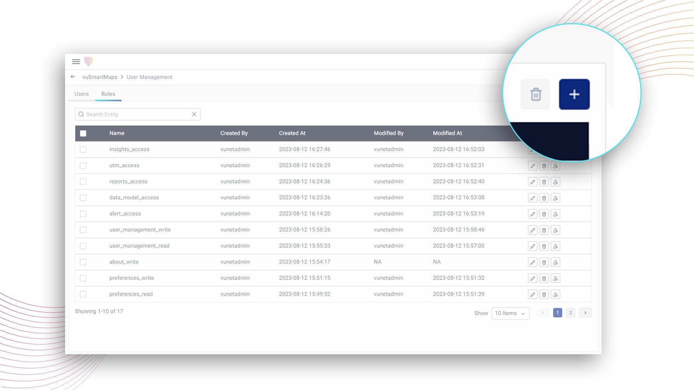

This will open a new page where you can enter a Role Name and select a list of users that you want to add to this group.

Also, the user role-specific homepage can be set here under **Select HomePage**. A specific dashboard can be set as the default landing page for this particular user role for the web app as well as for the mobile app.

Additionally, you can set the Data Access Policy to provide granular data access controls for user roles. The details on the Data Access Policy are discussed [here](./user-specific-views.md) in detail.

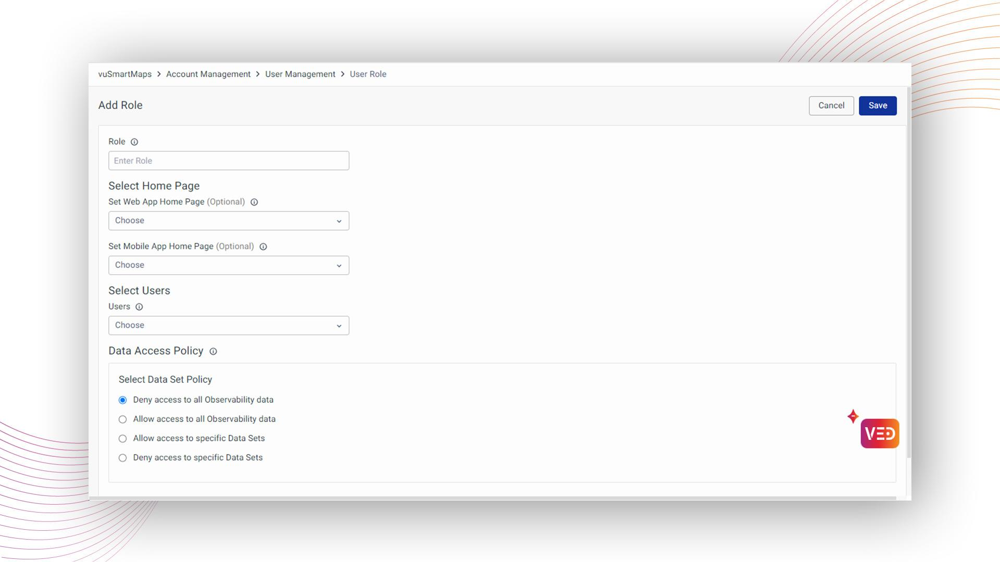

Alternatively, you can link users to Roles from the Edit Role section.

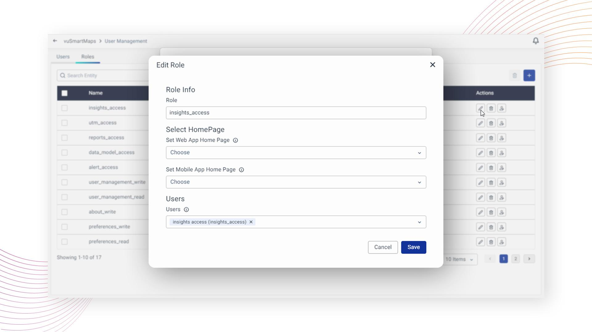

Once you have entered all the required information, click on the **Save** button to create the new Role.

## Assign Permissions to a Role

To assign permissions to a Role, select the Role to which you want to grant permissions and click on the **Edit Role Permissions** icon, as shown below:

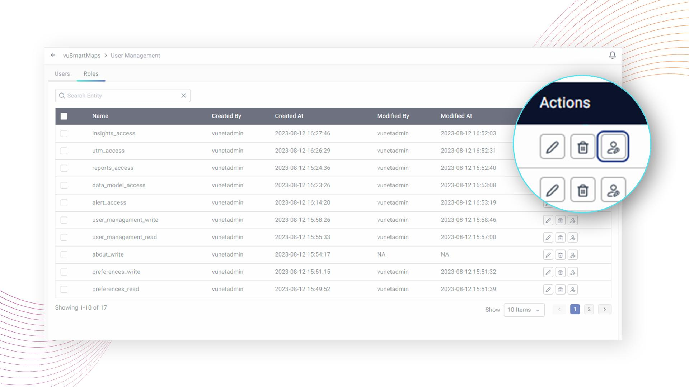

When you click on the **Edit Role Permissions** icon for a Role, a modal will appear displaying a list of modules and the permissions that can be assigned to each module. 

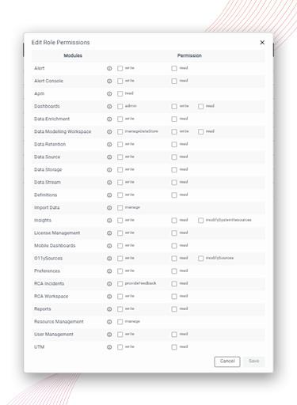

After selecting the appropriate permissions, click on the **Save** button located at the bottom of the modal to save the configuration for the Role.

:::note

1. Please note that when you grant 'write' permission to a module for a Role, the corresponding 'read' permission is also implicitly granted for the same module.
2. Additionally, giving permission to one module may result in implicit permission being granted to another module. For example, granting ‘write' permission to the Alert Rules module will also implicitly grant 'Data Model' read permission to that Role.

The below snapshot shows one example, where the selection of Alert Write permissions, grants read permissions for that module automatically. And similarly also grants read permission for Data Model.

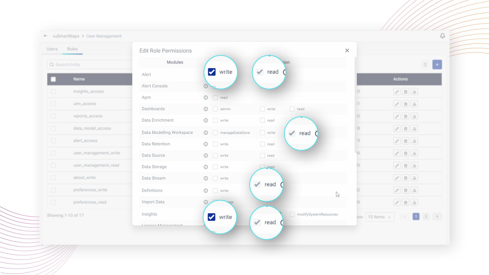

Logging in with such a user will give access to that user with a read-only view of the Data Modelling workspace.

:::

### Managing Password Change Permissions

In vuSmartMaps, administrators now have the ability to control password change permissions for end users, ensuring tighter security measures and compliance within the platform. This user guide section outlines how to utilize this feature effectively.

#### Enabling Password Change Permissions

1. Within the Edit role settings under Roles, locate the 'Miscellaneous' permission category.

2. Enable the 'changePassword' rule under this category to allow password changes for users assigned to this role. Deselect the option to disable password change. It is to be noted that this option is enabled by default.

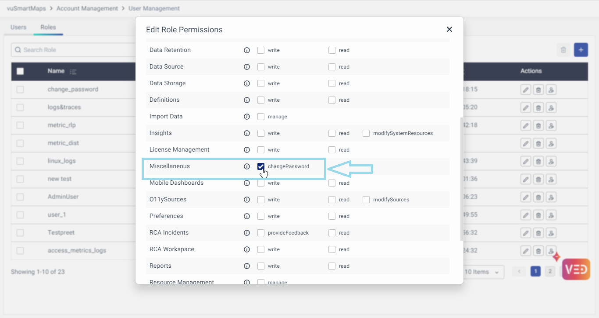

3. After configuring the permissions, save the role settings to apply the changes.

4. Users assigned to roles with the Change Password Permission will be able to update their password with the Change Password option.

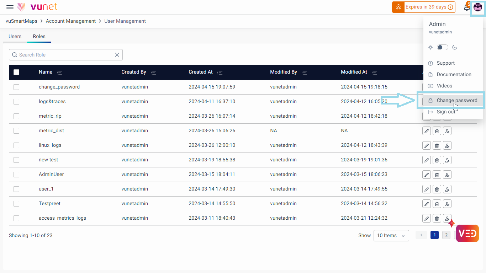

5. Users assigned to roles with the Disabled Change Password permission will find the Change Password field disabled in their profile section upon login. Hovering over the disabled field will display a message informing the user that they do not have permission to change their password.

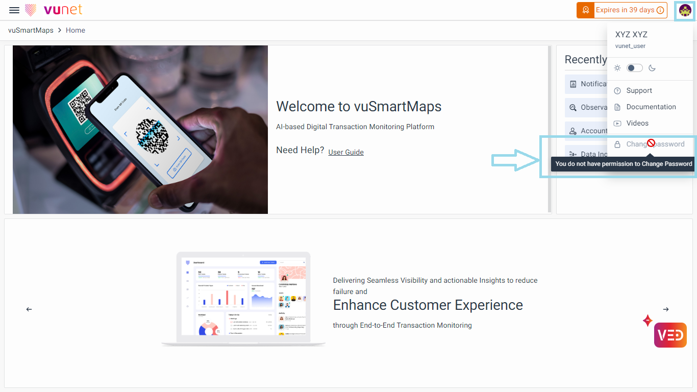

## Updating Role’s Default Homepage and Users

In user management, you can set a specific homepage for each user role. This means that when a user with a specific role, logs in, they will be directed to a personalized dashboard that suits their role. You can choose a different dashboard for the web app and the mobile app if desired.

1. To update the default landing page, you can edit the role by clicking on the **Edit** button.
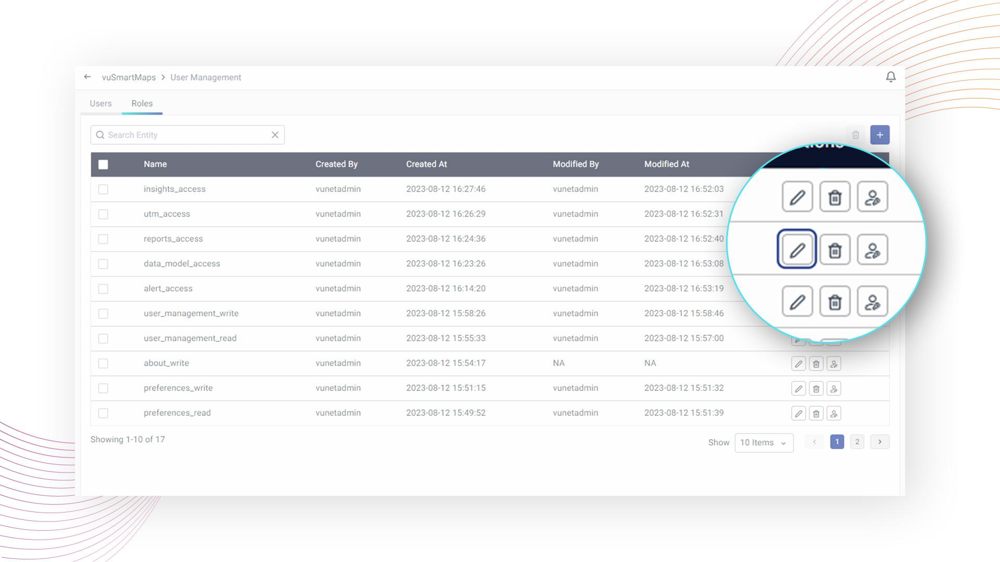

2. On clicking the **Edit** button, a pop-up will open, where you can modify the preference for the homepage for the web app and mobile app under **Select HomePage**. Similarly, Users can also be updated for the role from this pop-up on the Edit screen. Clicking **Save** will update the details for the specific role.
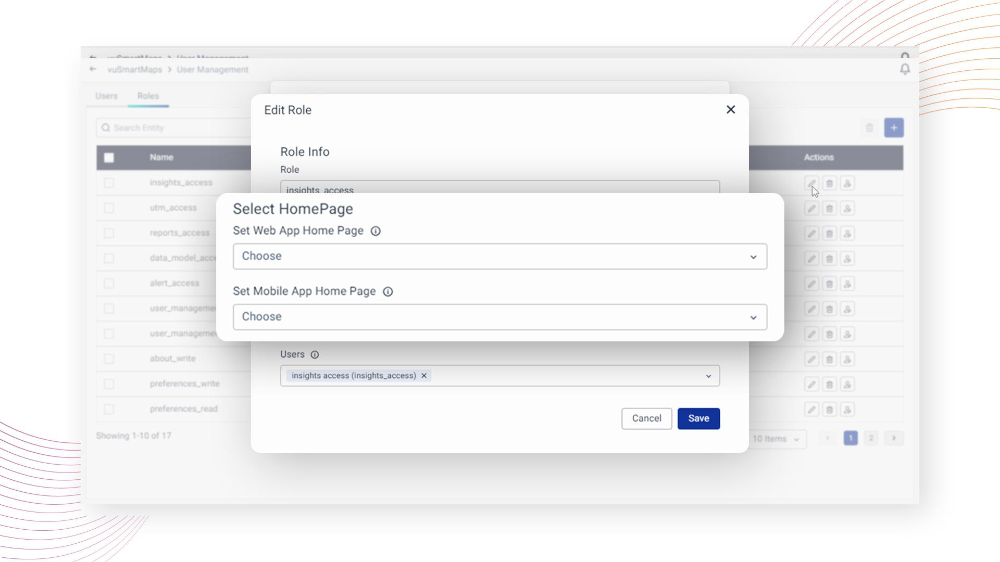

## Roles Deletion

To delete specific Role(s), follow these steps in the User Management module:

1. Locate the Roles(s) you wish to delete and select the checkbox next to their names.

2. Click on the **Delete Roles** icon.

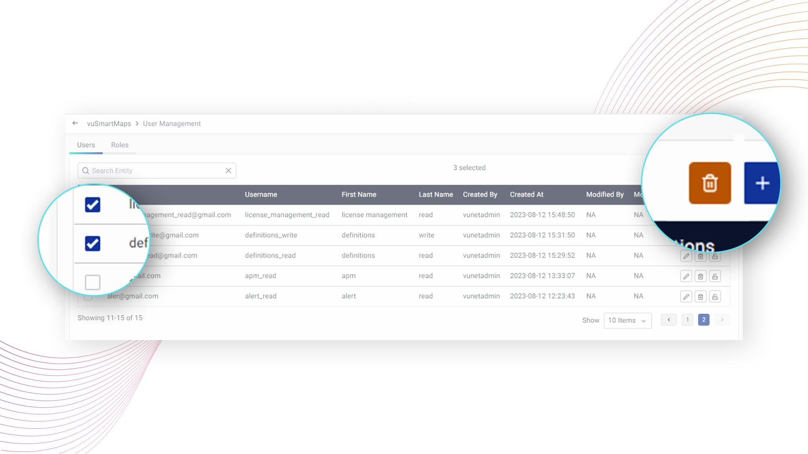

3. A pop-up window will appear, asking you to confirm the deletion of the selected user(s).

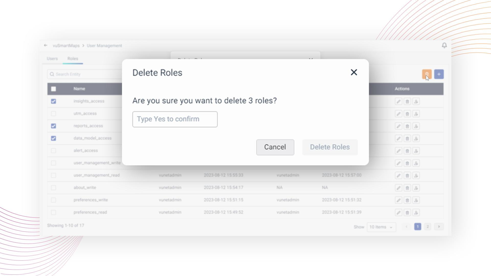

4. In the pop-up, type "Yes" in the provided text box to confirm the deletion. Click on the **Delete Roles** button.

5. The selected Roles will be deleted.

6. Similarly, to delete some particular user, the **Delete Role** Icon can be used across that particular user.

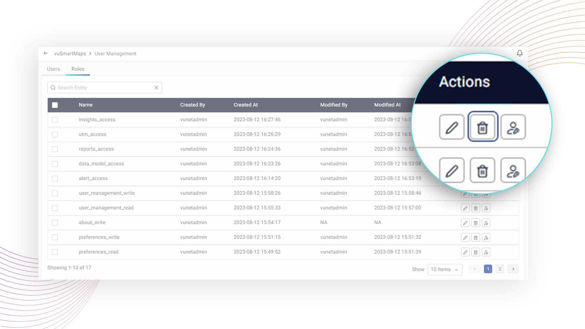

:::note
Please note that any user with write permissions to the User Management module has the ability to delete any Role.
:::