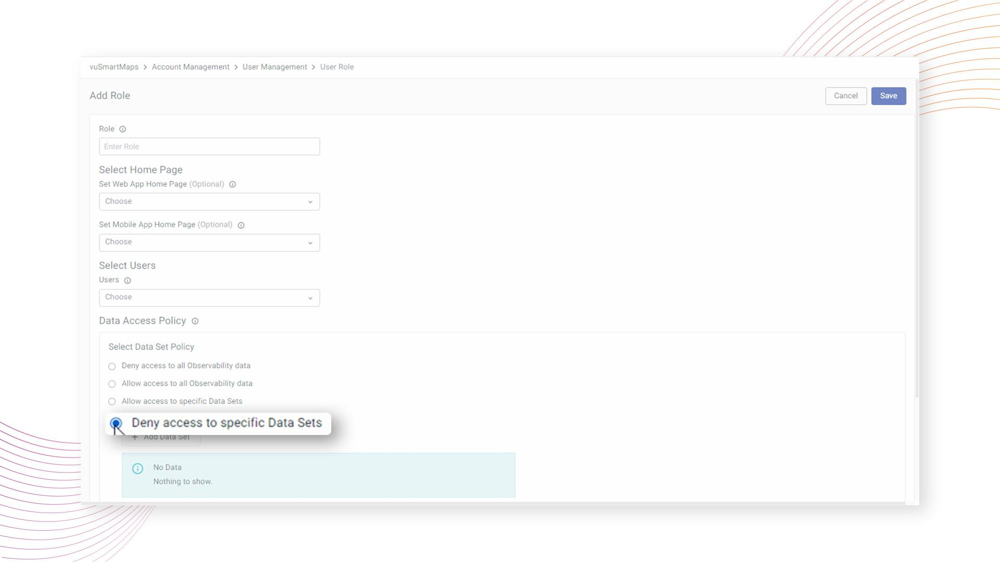

# User-Specific Views

User-Specific Views in vuSmartMaps ensure that users accessing the same dashboards can view data according to the policies configured for their respective roles. User-specific views are designed to provide a personalized and secure data experience tailored to individual roles within your organization. User-specific views will be applied based on the Role for Data store access control field set for the user.

User-specific views address the need for common dashboards to offer customized data displays based on user roles and their associated policies. By configuring data access policies for user roles, you can control and restrict the data visible to users, ensuring they only see information relevant to their roles and responsibilities.

## Tenant-Specific Data Isolation

To enhance data security, users from different tenants are isolated from each other. They cannot see each other's data, except for super tenants who have broader visibility. This ensures that data remains confidential and exclusive to the respective tenants.

## Data Access Policies

To achieve this, User-Specific Views operate on two main data access policies:

### Data Set Policy

There are four options under Data Set Policy, allowing administrators to finely control data access:

1. Deny Access to All Observability Data
2. Allow Access to All Observability Data
	1. Users can access the entire observability data set.
3. Allow Access to Specific Data Sets
	1. Users can select one or more data categories for access.
4. Deny Access to Specific Data Sets
	1. Users can restrict access to specific data categories.

**Data Set Categories**

User-Specific Views support seven distinct data set categories, enabling users to choose and configure their preferred data sets:

1. Traces
2. RUM
3. Logs
4. Metrics
5. Events
6. Transactions
7. Custom

:::note
It is to be noted that the policies will apply to tables with specific prefixes as outlined below:
| Category | Table Name Prefix |
|---|---|
| Traces | `vtraces` |
| RUM | `vrum` |
| Logs | `vlogs` |
| Metrics | `vmetrics` |
| Events | `vevents` |
| Transactions | `vtrans` |
:::

### Record Level Policies

In addition to Data Set Policies, administrators can define access permissions at the record level through record-level policies. This feature allows for more granular control, permitting administrators to set specific access rules based on column values for tables within a data category.

Now, let's delve into the detailed configuration and usage of User-Specific Views to optimize your dashboard experience based on roles and policies.

## Selecting Data Set Policy

While [creating a new role](./roles/#role-creation), you need to select Data Set Policy from the following 4 options:

1. Deny access to all Observability data
2. Allow access to all Observability data
3. Allow access to specific Data Sets
4. Deny access to specific Data Sets

### Deny access to all Observability data

Administrators possess the capability to impose access restrictions on entire observability datasets for specific roles, significantly enhancing data security. This measure explicitly denies access to observability data for roles where heightened security is a priority.

**Example:**

Consider a scenario where a user is assigned a role configured with the "Deny Access to all Observability Data" policy in the Data Access settings.

In this case, the user mapped to this role will be unable to access any observability data. The resulting dashboard will display no data, showing the restricted access enforced by the specified data policy.

### Allow access to all Observability data

Administrators possess the authority to grant access to the entire observability dataset for specific roles, providing meticulous control over data permissions. This facilitates precise management of observability data access in alignment with distinct roles and responsibilities, allowing seamless data access with a single click.

**Example:**

Consider a scenario where a user is assigned a role configured with the "Allow Access to all Observability Data" policy in the Data Access settings.

In this case, the user mapped to this role will have unrestricted access to all observability data. The resulting dashboard will display the complete dataset, showcasing the comprehensive access granted to the user based on the specified data policy.

### Allow access to specific Data Sets

With the "Allow access" policy, users can meticulously choose data categories and grant access to specific datasets, fostering a streamlined approach to viewing tailored data while adhering to organizational data compliance.

Users have the flexibility to select desired datasets within predefined categories such as Traces, RUM, Logs, Metrics, Events, and Transactions, or even opt for a custom dataset.

In the case of a "Custom" category selection, users can create a custom category with a designated name and choose specific tables for access.

**Example:**

Imagine a user assigned a role configured with the "Allow access to specific Data Sets" policy, allowing access to the "Events" data category.

In this scenario, the user will have access to event data on dashboards, providing a focused and compliant data viewing experience. The dashboard will display only the allowed data, exemplifying the effectiveness of the applied data access policy.

### Deny access to specific Data Sets

By adopting the "Deny access" policy, users can define access restrictions, enhancing security measures through a user-friendly interface within vuSmartMaps.

Upon selecting the policy, users are empowered to choose one or more data categories for denial, ensuring a tailored approach to access control. For instance, an administrator aiming to limit data access for a specific role in the APM data category can seamlessly select the APM category under the "Deny Access to specific data category" policy.

In cases where a "Custom" category is chosen, users are provided the flexibility to create a custom category with a designated name and specify tables to be denied access. vuSmartMaps diligently enforces these access restrictions, actively preventing users associated with the configured role from accessing the restricted datasets.

**Example:**

Consider a role configured with the "Deny access to specific Data Sets" policy, denying access to data categories such as transactions, traces, rum, events, and custom.

For a user linked to this role, the dashboard will display visible data only for permitted datasets, exemplifying the effective implementation of access restrictions based on the configured policy.

## Adding Record Level Policies

In vuSmartMaps, administrators can establish access controls at the granular level of individual records within a specific data category. This level of precision empowers administrators to define access policies tailored to their organization's requirements.

Administrators can initiate the creation of a new access policy by clicking on the **+ Add Policy** button, and selecting the option that leads to policy definition.

1. Users are prompted to choose the relevant "Data Category" for which the access policy will be formulated.
2. Upon selecting the data category, the system automates the population of the "Name" and "Tables" fields, streamlining the configuration process.  In cases where "Custom" is selected as the data category, users have the flexibility to manually enter the "Name" and "Table Name."
3. Users are then guided to input the specific "Column Name" for which the access policy will be applied.
4. Users are presented with the option to specify whether the policy is intended to "Allow" or "Restrict" access.
5. To enact the policy, users input desired column values within single quotes, separating each value by a comma (e.g., 'John, Smith', 'Ram').
6. For further refinement, the system allows users to choose "Yes" or "No" for "Must Match" when applying a "Restrict access policy”. When the "Restrict access policy" is applied to a column, users with corresponding roles should be denied access to records that meet the specified criteria in the designated column within the defined "Data Category".

**Example:**

Consider a scenario where the role denies access to the "rum" data category. Record level policies are then configured to allow access for "span id 112" in "rum," restrict access for "appname UPI" in "transactions," and allow access for "span attribute location chennai" in "traces”.

For the user associated with this role, the resulting dashboard reflects visible and hidden data as per the defined dataset and record-level policies.

