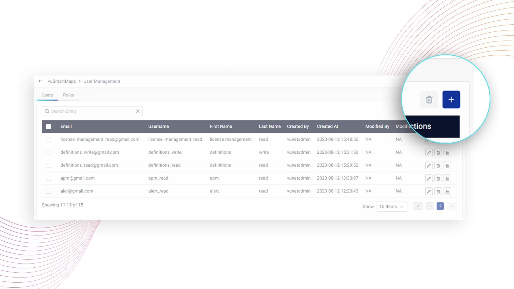
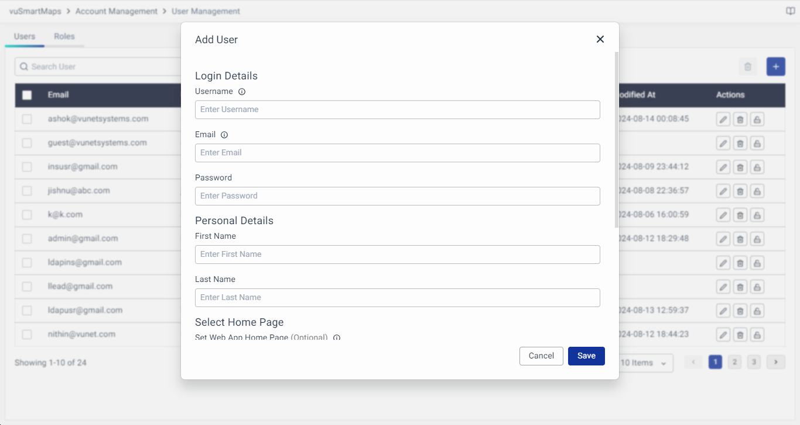
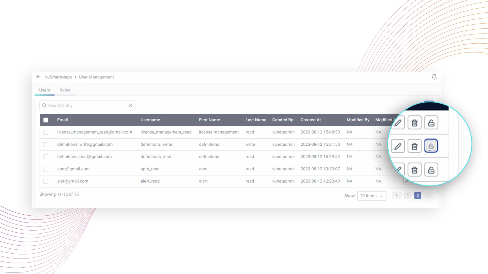
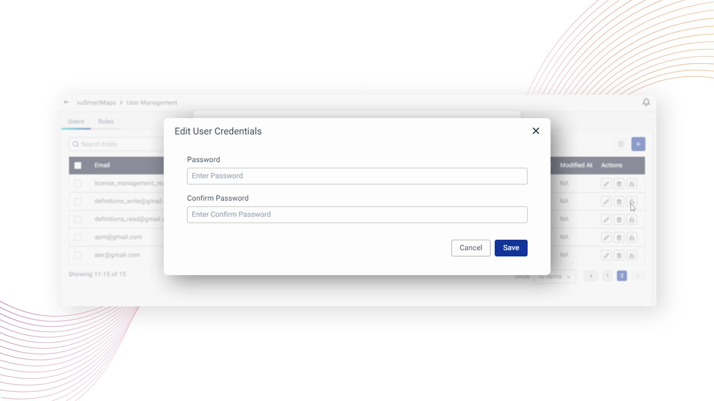
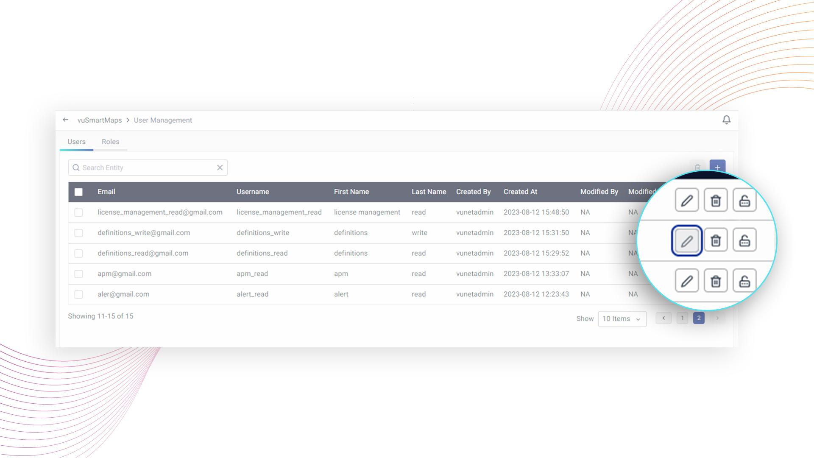
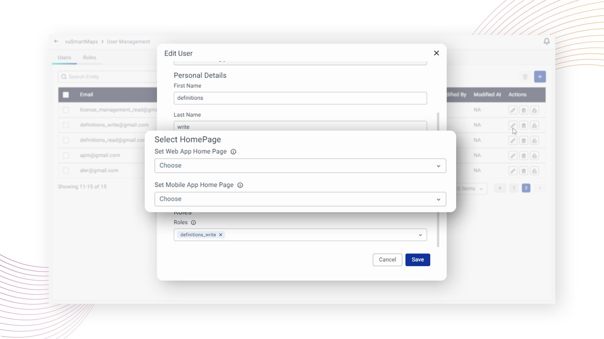
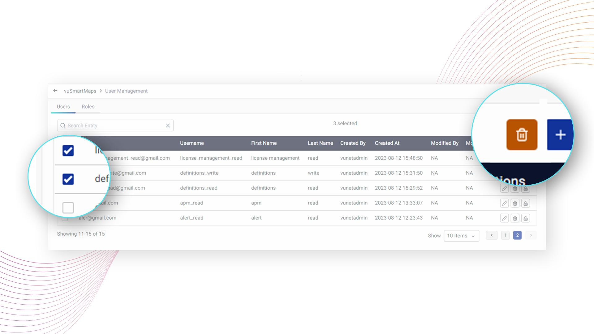
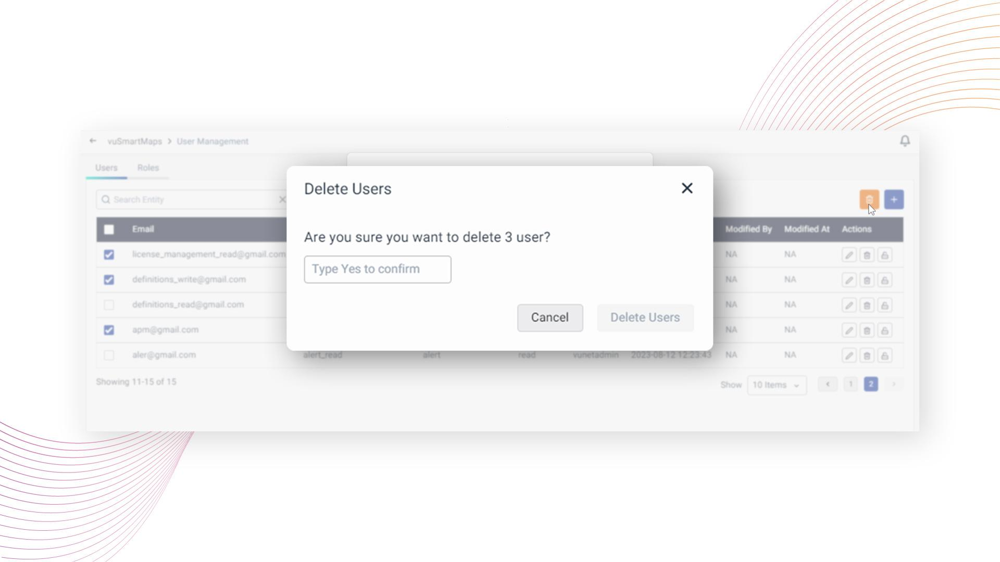

# Users

In the User Management module, you can perform several actions such as creating, editing, and deleting users. Additionally, you can configure which roles a particular user can be assigned. To access this module, click on the 'Users' tab, where you'll see a list of all users along with icons for creating a new user and deleting existing ones.

The user listing page displays information about each user, and users with the write permissions can edit user information and modify credentials by clicking on the appropriate user. The user listing page is shown below:

## User Creation

To create a new user, click on the **+** button located on the user listing page. This will open a modal where you can enter user information, including a unique username that will be used for logging in, email address, password, the user's first name, and last name

You can also select one or more **Roles** that the user will be a member of. The user will be granted permissions based on the logical union of permissions assigned to each selected Role.

Additionally, **Role for Data store access control**, can be specified. If multiple roles are assigned to the user, this drop-down allows you to specify which role will be used to determine data access permissions. The Role for Data store access control field must be selected from the roles assigned to the user.

Also, the user-specific homepage can be set here under **Select HomePage**. A specific dashboard can be set as the default landing page for this particular user for the web app as well as for the mobile app.

Once you have entered all the required fields, click on the **Save** button at the bottom of the modal to create a new user.

:::note

1. For LDAP users, only the fields Role for Data store access control, Select Home Page for web and mobile App are editable.
2. The Role for Data store access control is automatically synced during LDAP synchronization and is assigned to one of the roles already attached to the user.
:::

## Updating a User’s Password

To update the password for a specific user, follow these steps in the User Management module:

1. Locate the user for whom you want to update the password.

2. Click on the **Change Password** button corresponding to that user.

3. A pop-up window will appear, allowing you to edit the user's credentials.

4. In the pop-up, provide the new password for the user.

5. After entering the new password, click on the **Save** button. The password for the selected user will be updated.

:::note
Please note that, any user with write permissions to the User Management module has the ability to update the password for any user.
:::

## Updating the User’s Default Homepage and Roles

In user management, you can set a specific homepage for each user. This means that when a user logs in, they will be directed to a personalized dashboard that suits their preference and role. You can choose a different dashboard for the web app and the mobile app if desired.

1. To update the default landing page, you can edit the user by clicking on the Edit button.

2. On clicking the Edit button, a pop-up will open, where you can modify the preference for the homepage for the web app and mobile app under Select HomePage. Similarly, Roles can also be updated for the user from this pop-up on the Edit screen. Clicking Save will update the details for the specific user.

## User Deletion

To delete specific user(s), follow these steps in the User Management module:

1. Locate the user(s) you wish to delete and select the checkbox next to their names. And, click on the **Delete Users** icon.

2. A pop-up window will appear, asking you to confirm the deletion of the selected user(s).

3. In the pop-up, type "Yes" in the provided text box to confirm the deletion. Click on the **Delete Users** button.

4. The selected user(s) will be deleted.

:::note
Please note that, any user with write permissions to the User Management module has the ability to delete any user.
:::